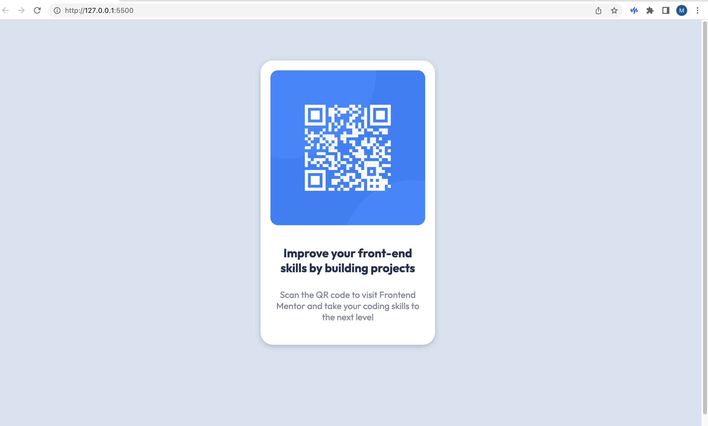

# Frontend Mentor - QR code component solution

This is a solution to the [QR code component challenge on Frontend Mentor](https://www.frontendmentor.io/challenges/qr-code-component-iux_sIO_H). Frontend Mentor challenges help you improve your coding skills by building realistic projects.

## Table of contents

- [Overview](#overview)
  - [Screenshot](#screenshot)
  - [Links](#links)
- [My process](#my-process)
  - [Built with](#built-with)
  - [What I learned](#what-i-learned)
  - [Continued development](#continued-development)
  - [Useful resources](#useful-resources)
- [Author](#author)

## Overview

### Screenshot

### Links

- Solution URL: [Add solution URL here](https://your-solution-url.com)
- Live Site URL: [github pages](https://smarko-web.github.io/QR-code-component/)

## My process

### Built with

- Semantic HTML5 markup
- CSS custom properties
- Flexbox

### What I learned

I’ve learned how to use google to solve problems that I faced including:

- Aligning elements 
- Interesting width 
- Adjusting padding 
- Difference between main and body tags

### Continued development

I would like to become more proficient in my HTML and CSS skills before I start doing more advanced web development. As I am practicing these skills, applying the prior knowledge that I have grained from YouTube and other Self paced courses, increasing confidence in web design.

### Useful resources

- [main vs body html](https://www.tutorialstonight.com/main-vs-body-html#:~:text=Tag,of%20the%20element.) - The artice gives an easy explanation between the main and body tags.
- [main vs body html stackoverflow](https://stackoverflow.com/questions/56803764/what-is-the-main-tag-in-html5-how-does-it-differ-from-body-tag) - Found the anwser to the question.

## Author

- Frontend Mentor - [@smarko-web](https://www.frontendmentor.io/profile/smarko-web)
